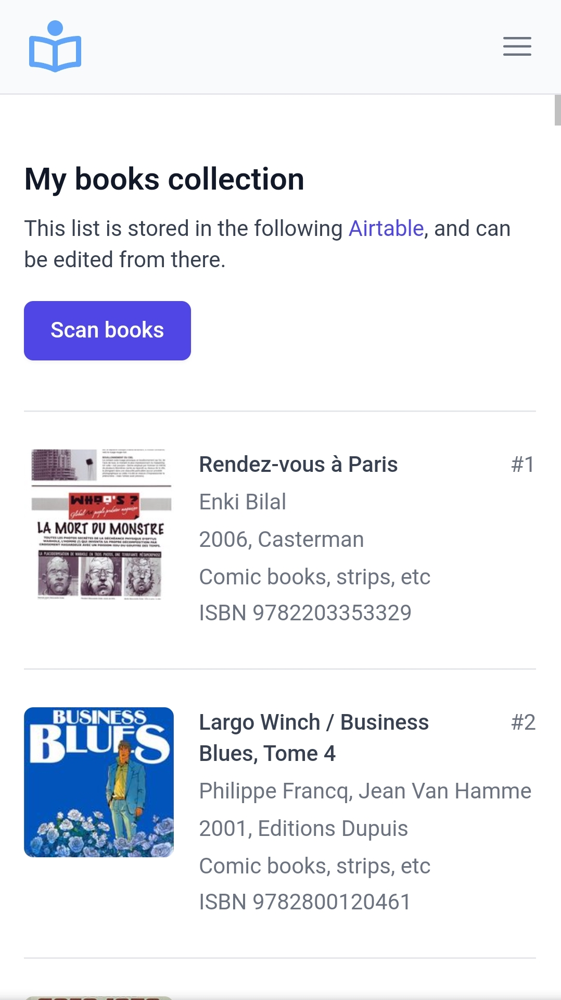
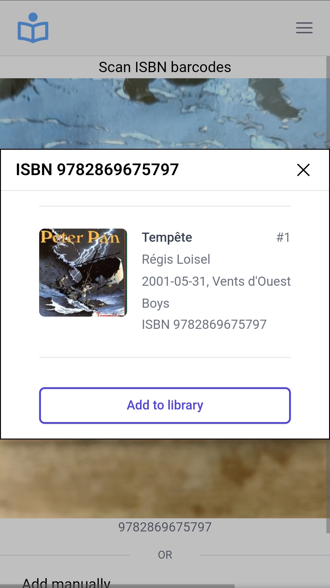

# Airlibris

**A Remix project to manage your book collection in Airtable. 📙 📚 🤘**

<p align="center" >
  
  &nbsp;  &nbsp;
  
</p>

## Features:

- Login using google OAuth
- Scan barcode books
- Retrieve books from ISBN number
- Save new books in Airtable
- List all books in Airtable

[Demo available here.](https://airlibris-demo.vercel.app)

## Stack

- Remix, typescript, TailwindCSS.
- Deployable on Vercel.

## Setup

### Configure Airtable

Create an Airtable base named "Books", with the following fields:

- id: Single line text
- isbn: Single line text
- title: Single line text
- authors: Single line text
- serie: Single line text
- description: Long text
- image: URL
- categories: Single line text
- publisher: Single line text
- publishedDate: Single line text
- pageCount: Number
- language: Single line text

Copy the airtable base ID for later (a string starting by "app" in the airtable URL).

Generate your Airtable API key [here](https://airtable.com/account), and copy it for later.

### Configure Google Oauth

Create an OAuth 2.0 Client IDs [here](https://console.cloud.google.com/apis/credentials), with the following parameters:

- Authorized JavaScript origins:
  - Your vercel app URL (aka https://[my-vercel-app].vercel.app)
  - http://localhost:3000 (if you want to launch it locally)
- Authorized redirect URIs:
  - https://[my-vercel-app].vercel.app/auth/google/callback
  - http://localhost:3000/auth/google/callback (if you want to launch it locally)

Copy the Client ID and Client secret for later.

### Deploy the project on Vercel

Once deployed, go to your Vercel "Project settings" > "Environment variables",
and fill the following variables:

- AIRTABLE_API_KEY: your Airtable API Key
- AIRTABLE_BASE_ID: your Airtable Base ID (start with app...)
- GOOGLE_AUTH_CLIENT_ID: your Google auth client ID
- GOOGLE_AUTH_CLIENT_SECRET: your Google auth secret ID
- ADMIN_EMAIL: your Google email to authorize access
- SESSION_SECRET: any generated random string
- SERVICE_URL: your vercel URL (aka https://[my-vercel-app].vercel.app)

## Development

To run your Remix app locally, copy the `.env.example` file to .env, and complete it with the information collected above.

Then, install your project's local dependencies:

```sh
yarn install
yarn run dev
```

Open up [http://localhost:3000](http://localhost:3000) and you should be ready to go!

## Thanks

A special thanks to [Christoph Oberhofer](https://github.com/serratus), who has developed [QuaggaJS](https://github.com/serratus/quaggaJS). I've tried a few libs before this one, and it works like a charm!
